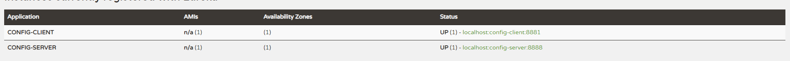

> 继 cluster-config-server README.MD.

## 三、改造 config-client

将其注册微到服务注册中心，作为Eureka客户端，需要pom文件加上起步依赖spring-cloud-starter-netflix-eureka-client，代码如下：

```xml
<dependencies>
    <dependency>
        <groupId>org.springframework.cloud</groupId>
        <artifactId>spring-cloud-starter-config</artifactId>
    </dependency>

    <dependency>
        <groupId>org.springframework.boot</groupId>
        <artifactId>spring-boot-starter-web</artifactId>
    </dependency>

    <dependency>
        <groupId>org.springframework.cloud</groupId>
        <artifactId>spring-cloud-starter-netflix-eureka-client</artifactId>
    </dependency>
</dependencies>
```

配置文件bootstrap.properties，注意是bootstrap。加上服务注册地址为http://localhost:8761/eureka/

```properties
spring.application.name=config-client
spring.cloud.config.label=master
spring.cloud.config.profile=dev

eureka.client.serviceUrl.defaultZone=http://localhost:8761/eureka/
spring.cloud.config.discovery.enabled=true
spring.cloud.config.discovery.serviceId=config-server
server.port=8881
```

- spring.cloud.config.discovery.enabled 是从配置中心读取文件。
- spring.cloud.config.discovery.serviceId 配置中心的servieId，即服务名。

这时发现，在读取配置文件不再写ip地址，而是服务名，这时如果配置服务部署多份，通过负载均衡，从而高可用。

依次启动eureka-servr,config-server,config-client 访问网址：http://localhost:8761/



访问http://localhost:8881/hi，浏览器显示：

> foo version 21


