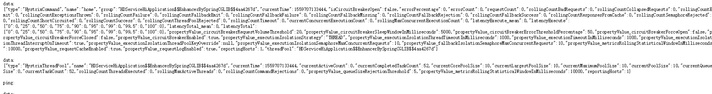
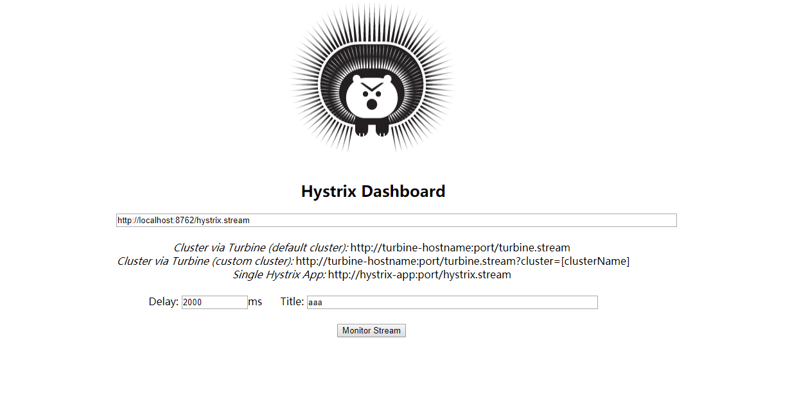
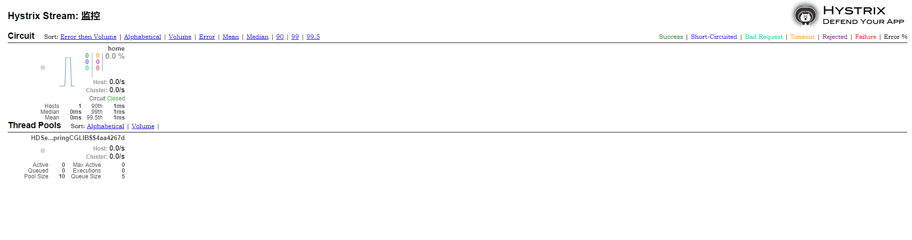

> 在 `service-feign` 工程中我们演示了如何在使用断路器, 并简单的介绍了 `hystrix dashboard` 组件, 
这篇文章更加详细的介绍了 `hystrix dashboard`。

## 一、Hystrix Dashboard简介
在微服务架构中为例保证程序的可用性，防止程序出错导致网络阻塞，出现了断路器模型。断路器的状况
反应了一个程序的可用性和健壮性，它是一个重要指标。Hystrix Dashboard是作为断路器状态的一个
组件，提供了数据监控和友好的图形化界面。

## 二、准备工作
基于 `service-hi` 改造。

## 三、开始改造service-hi
在pom的工程文件引入相应的依赖：

```
<dependencies>
    <dependency>
        <groupId>org.springframework.cloud</groupId>
        <artifactId>spring-cloud-starter-netflix-eureka-client</artifactId>
    </dependency>
    <dependency>
        <groupId>org.springframework.boot</groupId>
        <artifactId>spring-boot-starter-web</artifactId>
    </dependency>
    <dependency>
        <groupId>org.springframework.boot</groupId>
        <artifactId>spring-boot-starter-actuator</artifactId>
    </dependency>
    <dependency>
        <groupId>org.springframework.cloud</groupId>
        <artifactId>spring-cloud-starter-netflix-hystrix</artifactId>
    </dependency>
    <dependency>
        <groupId>org.springframework.cloud</groupId>
        <artifactId>spring-cloud-starter-netflix-hystrix-dashboard</artifactId>
    </dependency>
</dependencies>
```

如下注解在启动类上面是必须的.

| 名称  | 作用 |
|---| --- | 
| @EnableHystrix  | 开启断路器 |
| @HystrixCommand  | 声明断路点 |
| @EnableHystrixDashboard  | 开启 HystrixDashboard |

启动类代码如下:

```java
@SpringBootApplication
@EnableEurekaClient
@EnableDiscoveryClient
@RestController
@EnableHystrix
@EnableHystrixDashboard
@EnableCircuitBreaker
public class HDServiceHiApplication {

    /**
     * 访问地址 http://localhost:8762/actuator/hystrix.stream
     * @param args
     */
    public static void main(String[] args) {
        SpringApplication.run( HDServiceHiApplication.class, args );
    }

    @Value("${server.port}")
    String port;

    @RequestMapping("/hi")
    @HystrixCommand(fallbackMethod = "hiError")
    public String home(@RequestParam(value = "name", defaultValue = "hystrix-dashboard-service-hi") String name) {
        return "hi " + name + " ,i am from port:" + port;
    }

    public String hiError(String name) {
        return "hi,"+name+",sorry,error!";
    }

}
```

添加 `/hystrix.stream` 配置

```java
@Configuration
public class HystrixConfig {

    @Bean
    public HystrixMetricsStreamServlet hystrixMetricsStreamServlet(){
        return new HystrixMetricsStreamServlet();
    }

    @Bean
    public ServletRegistrationBean<HystrixMetricsStreamServlet> registration(HystrixMetricsStreamServlet servlet){
        ServletRegistrationBean<HystrixMetricsStreamServlet> registrationBean = new ServletRegistrationBean<>();
        registrationBean.setServlet(servlet);
        //是否启用该registrationBean
        registrationBean.setEnabled(true);
        registrationBean.addUrlMappings("/hystrix.stream");
        return registrationBean;
    }
}
``` 

运行程序： 依次开启eureka-server 和service-hi.

## 四、Hystrix Dashboard图形展示

打开http://localhost:8762/hystrix.stream，可以看到一些具体的数据：



打开 http://locahost:8762/hystrix 可以看见以下界面：



在界面依次输入：http://localhost:8762/hystrix.stream 、2000 、监控 ；点确定。

在另一个窗口输入： http://localhost:8762/hi，多刷新几次

重新刷新hystrix.stream网页，你会看到良好的图形化界面：

