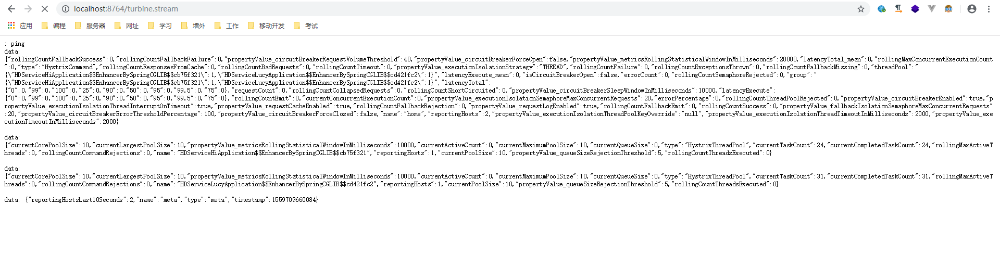
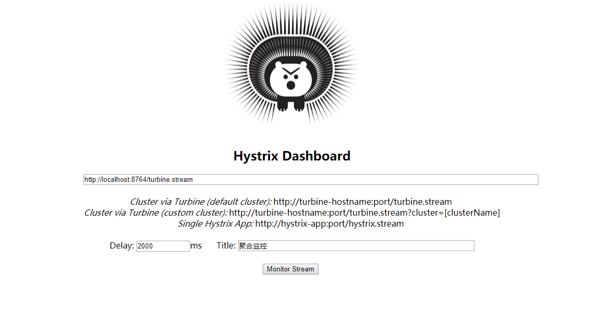
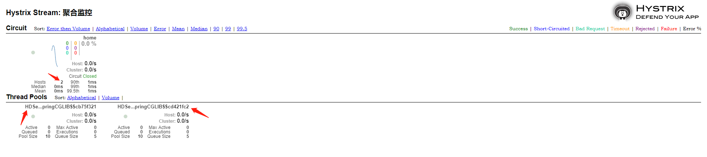

> 上一篇文章讲述了如何利用Hystrix Dashboard去监控断路器的Hystrix command。当我们有
很多个服务的时候，这就需要聚合所以服务的Hystrix Dashboard的数据了。这就需要用到
Spring Cloud的另一个组件了，即Hystrix Turbine。

## 一、Hystrix Turbine 简介
看单个的Hystrix Dashboard的数据并没有什么多大的价值，要想看这个系统的Hystrix Dashboard
数据就需要用到Hystrix Turbine。Hystrix Turbine将每个服务Hystrix Dashboard数据进行了整合。
Hystrix Turbine的使用非常简单，只需要引入相应的依赖和加上注解和配置就可以了。

## 二、准备工作
基于 `hystrix-dashboard-service-hi` 改造，创建名称为 `hystrix-dashboard-service-lucy` 工程, 
修改如下:

- server.port: 8763
- spring-application.name: hd-service-lucy

## 三、创建 service-turbine
在pom的工程文件引入相应的依赖：

```
<dependencies>
        <dependency>
            <groupId>org.springframework.cloud</groupId>
            <artifactId>spring-cloud-starter-netflix-eureka-client</artifactId>
        </dependency>
        <dependency>
            <groupId>org.springframework.boot</groupId>
            <artifactId>spring-boot-starter-web</artifactId>
        </dependency>
        <dependency>
            <groupId>org.springframework.boot</groupId>
            <artifactId>spring-boot-starter-actuator</artifactId>
        </dependency>
        <dependency>
            <groupId>org.springframework.cloud</groupId>
            <artifactId>spring-cloud-starter-netflix-hystrix</artifactId>
        </dependency>
        <dependency>
            <groupId>org.springframework.cloud</groupId>
            <artifactId>spring-cloud-starter-netflix-hystrix-dashboard</artifactId>
        </dependency>
        <dependency>
            <groupId>org.springframework.cloud</groupId>
            <artifactId>spring-cloud-starter-netflix-turbine</artifactId>
        </dependency>
</dependencies>
```

在其入口类ServiceTurbineApplication加上注解@EnableTurbine，开启turbine，@EnableTurbine注解包含了
@EnableDiscoveryClient注解，即开启了注册服务。

启动类代码如下:

```java
@SpringBootApplication
@EnableEurekaClient
@EnableDiscoveryClient
@RestController
@EnableHystrix
@EnableHystrixDashboard
@EnableCircuitBreaker
@EnableTurbine
public class ServiceTurbineApplication {

    /**
     * http://localhost:8764/turbine.stream
     */

    public static void main(String[] args) {
        SpringApplication.run( ServiceTurbineApplication.class, args );
    }
}

```

配置文件 `application.yml` 如下:

```yaml
server:
  port: 8764

spring:
  application:
    name: service-turbine

eureka:
  client:
    serviceUrl:
      defaultZone: http://localhost:8761/eureka/
management:
  endpoints:
    web:
      exposure:
        include: "*"
      cors:
        allowed-origins: "*"
        allowed-methods: "*"

turbine:
  app-config: service-hi,service-lucy
  aggregator:
    clusterConfig: default
  clusterNameExpression: new String("default")
  combine-host: true
  instanceUrlSuffix:
    default: hystrix.stream
```

## 四、Turbine 演示

依次开启如下四个工程: 
- eureka-server: 注册中心。
- hystrix-dashboard-service-hi: 服务单元。
- hystrix-dashboard-service-lucy: 服务单元。
- service-turbine: 聚合指定的 `服务单元` 的 hystrix dashboard 信息。

打开浏览器输入：http://localhost:8764/turbine.stream,界面如下：



打开 http://locahost:8762/hystrix 可以看见以下界面：



在界面依次输入：http://localhost:8764/turbine.stream 、2000 、聚合监控 ；点确定。

在其他窗口输入访问如下网址(多访问几次)：

- http://localhost:8762/hi
- http://localhost:8763/hi

重新刷新hystrix.stream网页，你会看到良好的图形化界面：



可以看到这个页面聚合了 2 个 service 的 hystrix dashbord 数据。