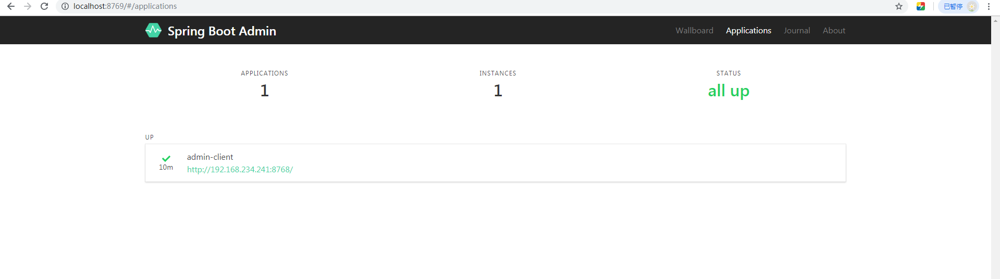
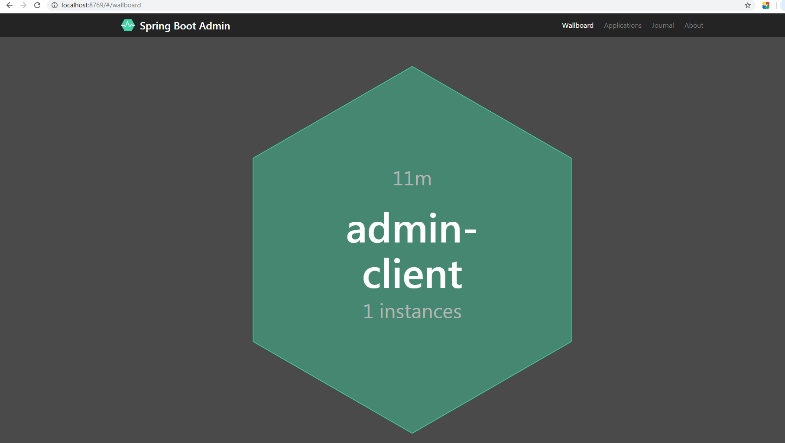
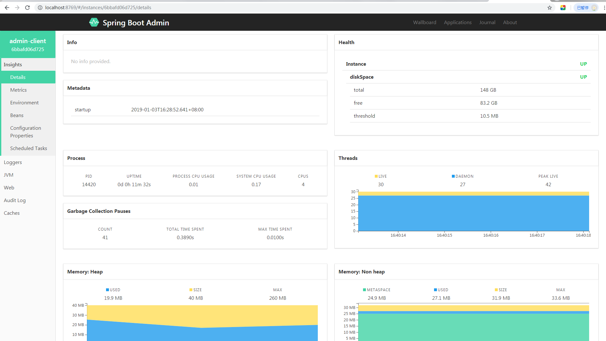
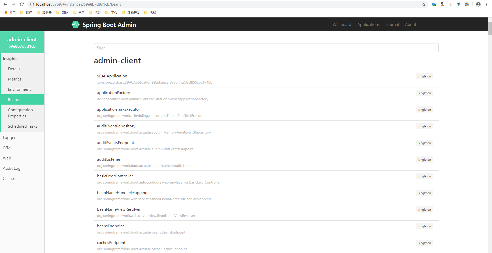
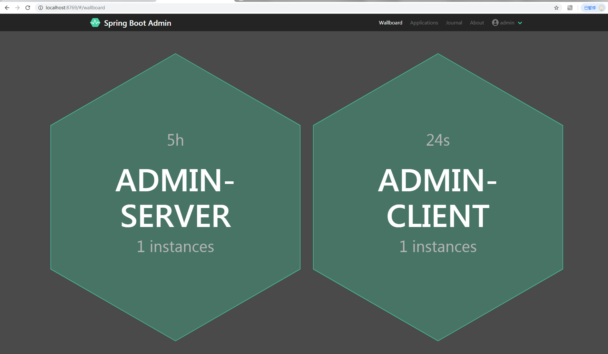
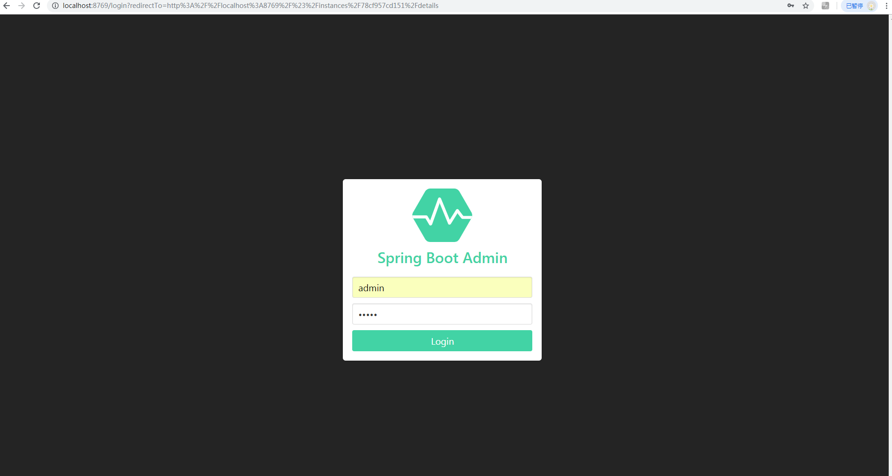

## 一、Spring Boot Admin简介
Spring Boot Admin是一个开源社区项目，用于管理和监控SpringBoot应用程序。 应用程序
作为Spring Boot Admin Client向为Spring Boot Admin Server注册（通过HTTP）或使用
SpringCloud注册中心（例如Eureka，Consul）发现。 UI是的AngularJs应用程序，展示
Spring Boot Admin Client的Actuator端点上的一些监控。

常见的功能或者监控如下：

- 显示健康状况
- 显示详细信息，例如
    - JVM和内存指标
    - micrometer.io指标
    - 数据源指标
    - 缓存指标
- 显示构建信息编号
- 关注并下载日志文件
- 查看jvm系统和环境属性
- 查看Spring Boot配置属性
- 支持Spring Cloud的postable / env-和/ refresh-endpoint
- 轻松的日志级管理
- 与JMX-beans交互
- 查看线程转储
- 查看http跟踪
- 查看auditevents
- 查看http-endpoints
- 查看计划任务
- 查看和删除活动会话（使用spring-session）
- 查看Flyway / Liquibase数据库迁移
- 下载heapdump
- 状态变更通知（通过电子邮件，Slack，Hipchat，……）
- 状态更改的事件日志（非持久性）

## 二、快速开始
### 1、创建Spring Boot Admin Server
本文的所有工程的Spring Boot版本为2.1.0 、Spring Cloud版本为Finchley.SR2。案例
采用Maven多module形式，父 pom 文件引入依赖, 完整参看顶层 `pom.xml`。

在工程admin-server引入admin-server的起来依赖和web的起步依赖，参看 
`spring-boot-admin/spring-boot-admin-server/pom.xml`。

然后在工程的启动类AdminServerApplication加上@EnableAdminServer注解，开启
AdminServer 的功能，代码如下：

```java
@SpringBootApplication
@EnableAdminServer
public class SBASApplication {
    public static void main(String[] args) {
        SpringApplication.run( SBASApplication.class, args );
    }
}
``` 

在工程的配置文件application.yml中配置程序名和程序的端口，代码如下：

```yaml
spring:
  application:
    name: admin-server
server:
  port: 8769
```

这样Admin Server就创建好了。

### 2、创建 Spring Boot Admin Client
在admin-client工程的pom文件引入admin-client的起步依赖和web的起步依赖，参看:
`spring-boot-admin/spring-boot-admin-client/pom.xml`。

在工程的配置文件application.yml中配置应用名和端口信息，以及向admin-server注册
的地址为http://localhost:8769，最后暴露自己的actuator的所有端口信息，具体配置
如下：

```yaml
spring:
  application:
    name: admin-client
  boot:
    admin:
      client:
        url: http://localhost:8769
server:
  port: 8768

management:
  endpoints:
    web:
      exposure:
        include: '*'
  endpoint:
    health:
      show-details: ALWAYS
```

在工程的启动文件如下：

```java
@SpringBootApplication
public class SBACApplication {
    public static void main(String[] args) {
        SpringApplication.run( SBACApplication.class, args );
    }
}
```

一次启动两个工程，在浏览器上输入localhost:8769 ，浏览器显示的界面如下：



查看 wallboard：



点击wallboard，可以查看admin-client具体的信息，比如内存状态信息：



也可以查看spring bean的情况：



更多监控信息，自己去探索！！！

## 三、Spring Boot Admin 结合 SC 注册中心使用
同上一个案例一样，本案例也是使用的是Spring Boot版本为2.1.0 、Spring Cloud版本为
Finchley.SR2。案例采用Maven多module形式，父pom文件引入以下的依赖（完整的依赖见源码），
此处省略。

### 1、搭建注册中心
注册中心使用 Eureka(服务注册中心), 参看 `spring-boot-admin/spring-boot-admin-eureka-server`。

配置 spring-boot-admin-eureka-server 的端口信息，以及defaultZone和防止自注册。最后系统暴露eureka-server
的actuator的所有端口。

```yaml
spring:
  application:
    name: eureka-server
server:
  port: 8761
eureka:
  client:
    service-url:
      defaultZone: http://localhost:8761/eureka
    register-with-eureka: false
    fetch-registry: false
management:
  endpoints:
    web:
      exposure:
        include: "*"
  endpoint:
    health:
      show-details: ALWAYS
```

在工程的启动文件 SBAEurekaServerApplication 加上 @EnableEurekaServer注解开启
Eureka Server.

```java
@SpringBootApplication
@EnableEurekaServer
public class SBAEurekaServerApplication {

    public static void main(String[] args) {
        SpringApplication.run( SBAEurekaServerApplication.class, args );
    }
}
```

spring-boot-admin-eureka-server 搭建完毕。 

### 2、搭建 spring-boot-admin-server-cloud
maven 配置参看 `spring-boot-admin/spring-boot-admin-server-cloud/pom.xml`。

然后配置admin-server，应用名、端口信息。并向注册中心注册，注册地址为http://localhost:8761，
最后将actuator的所有端口暴露出来，配置如下：

```yaml
spring:
  application:
    name: admin-server
server:
  port: 8769
eureka:
  client:
    registryFetchIntervalSeconds: 5
    service-url:
      defaultZone: ${EUREKA_SERVICE_URL:http://localhost:8761}/eureka/
  instance:
    leaseRenewalIntervalInSeconds: 10
    health-check-url-path: /actuator/health

management:
  endpoints:
    web:
      exposure:
        include: "*"
  endpoint:
    health:
      show-details: ALWAYS
```

在工程的启动类 SBASCApplication 加上@EnableAdminServer注解，开启admin server的功能，
加上@EnableDiscoveryClient注解开启 eureka client的功能。

```java
@SpringBootApplication
@EnableAdminServer
@EnableDiscoveryClient
public class SBASCApplication {
    public static void main(String[] args) {
        SpringApplication.run( SBASCApplication.class, args );
    }
}
```

### 3、搭建 spring-boot-admin-client-cloud
由于 2.1.0 采用 webflux，所以引入webflux的起步依赖，具体参看: `spring-boot-admin/spring-boot-admin-client-cloud/pom.xml`。

在工程的配置文件配置应用名、端口、向注册中心注册的地址，以及暴露actuator的所有端口。

```yaml
spring:
  application:
    name: admin-client
eureka:
  instance:
    leaseRenewalIntervalInSeconds: 10
    health-check-url-path: /actuator/health

  client:
    registryFetchIntervalSeconds: 5
    service-url:
      defaultZone: ${EUREKA_SERVICE_URL:http://localhost:8761}/eureka/
management:
  endpoints:
    web:
      exposure:
        include: "*"
  endpoint:
    health:
      show-details: ALWAYS
server:
  port: 8762
```

在启动类加上@EnableDiscoveryClie注解，开启DiscoveryClient的功能。

```java
@SpringBootApplication
@EnableDiscoveryClient
public class AdminClientApplication {
    public static void main(String[] args) {
        SpringApplication.run( AdminClientApplication.class, args );
    }
}
``` 

一次启动三个工程，在浏览器上访问localhost:8769，浏览器会显示和上一小节一样的界面。 



## 四、集成spring security

在2.1.0版本中去掉了hystrix dashboard，登录界面默认集成到了spring security模块，
只要加上spring security就集成了登录模块。

只需要改变下admin-server工程，需要在 spring-boot-admin-server-cloud(以下) 工程的
pom文件引入以下的依赖：

```xml
<dependency>
    <groupId>org.springframework.boot</groupId>
    <artifactId>spring-boot-starter-security</artifactId>
</dependency>
```

在相应工程的配置文件application.yml中配置spring security的用户名和密码，
这时需要在服务注册时带上metadata-map的信息，如下：

```yaml
spring:
  security:
    user:
      name: "admin"
      password: "admin"
      
eureka:
  instance:
    metadata-map:
      user.name: ${spring.security.user.name}
      user.password: ${spring.security.user.password}

```

写一个配置类SecuritySecureConfig继承WebSecurityConfigurerAdapter，配置如下：

```java
@Configuration
public class SecuritySecureConfig extends WebSecurityConfigurerAdapter {

    private final String adminContextPath;

    public SecuritySecureConfig(AdminServerProperties adminServerProperties) {
        this.adminContextPath = adminServerProperties.getContextPath();
    }

    @Override
    protected void configure(HttpSecurity http) throws Exception {
        // @formatter:off
        SavedRequestAwareAuthenticationSuccessHandler successHandler = new SavedRequestAwareAuthenticationSuccessHandler();
        successHandler.setTargetUrlParameter( "redirectTo" );

        http.authorizeRequests()
                .antMatchers( adminContextPath + "/assets/**" ).permitAll()
                .antMatchers( adminContextPath + "/login" ).permitAll()
                .anyRequest().authenticated()
                .and()
                .formLogin().loginPage( adminContextPath + "/login" ).successHandler( successHandler ).and()
                .logout().logoutUrl( adminContextPath + "/logout" ).and()
                .httpBasic().and()
                .csrf().disable();
        // @formatter:on
    }
}
````

重启启动工程，在浏览器上访问：http://localhost:8769/，会被重定向到登录界面，
登录的用户名和密码为配置文件中配置的，分别为admin和admin，界面显示如下：



## 五、集成邮箱报警功能
在spring boot admin中，也可以集成邮箱报警功能，比如服务不健康了、下线了，都可以
给指定邮箱发送邮件。集成非常简单，只需要改造下spring-boot-admin-server-cloud 即可：

在工程Pom文件，加上mail的起步依赖，代码如下：

```xml
<dependency>
    <groupId>org.springframework.boot</groupId>
    <artifactId>spring-boot-starter-mail</artifactId>
</dependency>
```

在配置文件application.yml文件中，需要配置邮件相关的配置，如下：

```yaml
spring:
  mail:
    host: smtp.163.com
    username: miles02
    password:
  boot:
    admin.notify.mail.to: 124746406@qq.com
```

做完以上配置后，当我们已注册的客户端的状态从 UP 变为 OFFLINE 或其他状态，
服务端就会自动将电子邮件发送到上面配置的地址。
