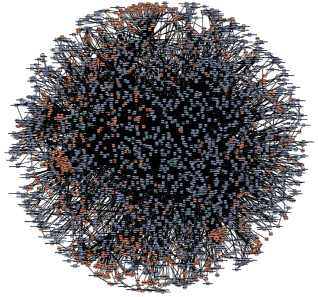
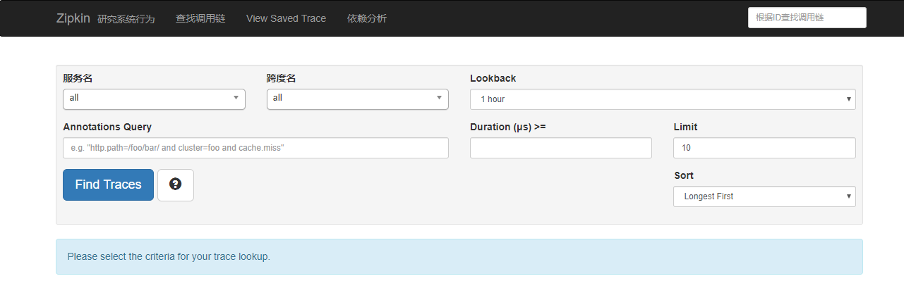
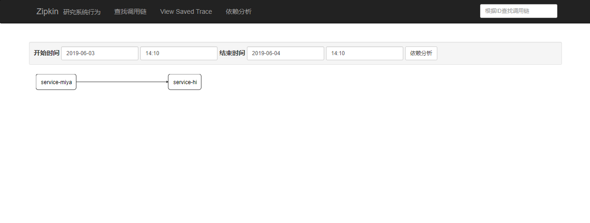
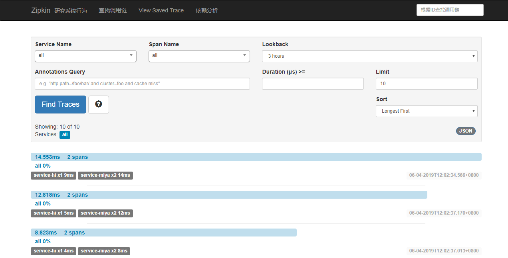

> 这篇文章主要讲述服务追踪组件zipkin，Spring Cloud Sleuth集成了zipkin组件。
## 一、简介
> Add sleuth to the classpath of a Spring Boot application (see below
> for Maven and Gradle examples), and you will see the correlation data
> being collected in logs, as long as you are logging requests.

Spring Cloud Sleuth 主要功能就是在分布式系统中提供追踪解决方案，并且兼容支持了 zipkin，
你只需要在pom文件中引入相应的依赖即可。

## 二、服务追踪分析
微服务架构上通过业务来划分服务的，通过REST调用，对外暴露的一个接口，可能需要很多个服务协同
才能完成这个接口功能，如果链路上任何一个服务出现问题或者网络超时，都会形成导致接口调用失败。
随着业务的不断扩张，服务之间互相调用会越来越复杂。

随着服务的越来越多，对调用链的分析会越来越复杂。它们之间的调用关系也许如下：

## 三、术语
Span：基本工作单元，例如，在一个新建的span中发送一个RPC等同于发送一个回应请求给RPC，span通过
一个64位ID唯一标识，trace以另一个64位ID表示，span还有其他数据信息，比如摘要、时间戳事件、关键
值注释(tags)、span的ID、以及进度ID(通常是IP地址) span在不断的启动和停止，同时记录了时间信息，
当你创建了一个span，你必须在未来的某个时刻停止它。

- Trace：一系列spans组成的一个树状结构，例如，如果你正在跑一个分布式大数据工程，你可能需要创建一个trace。
- Annotation：用来及时记录一个事件的存在，一些核心annotations用来定义一个请求的开始和结束.
  - Client Sent(cs): 客户端发起一个请求，这个annotion描述了这个span的开始
  - Server Received(sr): 服务端获得请求并准备开始处理它，如果将其sr减去cs时间戳便可得到网络延迟
  - Server Sent(ss): 注解表明请求处理的完成(当请求返回客户端)，如果ss减去sr时间戳便可得到服务端
  需要的处理请求时间
  - Client Received(cr): 表明span的结束，客户端成功接收到服务端的回复，如果cr减去cs时间戳便
  可得到客户端从服务端获取回复的所有所需时间
  
将Span和Trace在一个系统中使用Zipkin注解的过程图形化：

## 四、构建工程
基本知识讲解完毕，下面我们来实战，本文的案例主要有三个工程组成:一个server-zipkin,它的主要
作用使用ZipkinServer 的功能，收集调用数据，并展示；一个service-hi,对外暴露hi接口；一个
service-miya,对外暴露miya接口；这两个service可以相互调用；并且只有调用了，server-zipkin
才会收集数据的，这就是为什么叫服务追踪了。

### 1、构建 ZipKin
在spring Cloud为F版本的时候，已经不需要自己构建Zipkin Server了，只需要下载jar即可，
下载地址：

> https://dl.bintray.com/openzipkin/maven/io/zipkin/java/zipkin-server/

运行:

> java -jar zipkin-server-2.10.1-exec.jar

访问浏览器 http://localhost:9411

### 2、创建 zipkin-service-miya
> 见此工程

### 3、创建 zipkin-service-hi
> 见 zipkin-service-hi

## 五、演示
依次启动上面的工程，打开浏览器访问：http://localhost:9411/，会出现以下界面：

访问：http://localhost:8989/miya，浏览器出现：

> i’ m service-hi

再打开http://localhost:9411/的界面，点击Dependencies,可以发现服务的依赖关系：

点击find traces,可以看到具体服务相互调用的数据：

